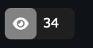

## Ot-Badge

 

### 15.01.2024

Unfortunately for the time being Ot Badge is suspending its operations. Maybe in the future I will add something new and start it up again

Ot Badge looked like this:

 

## Badges list:

#### Visits Badge

Returns a badge containing the visitor counter for your repository

<b>Link: </b><code>https://badges.olegtemek.site/visitor/{username}/{repo}</code>

 <b>Markdown: </b><code></code>

| Parameter    | Type                    | Description          |
| :----------- | :---------------------- | :------------------- |
| `style`      | `FLAT, REGULAR, ITALIC` | Default: "Regular"   |
| `iconColor`  | `string`                | Color for icon side  |
| `labelColor` | `string`                | Color for label side |
